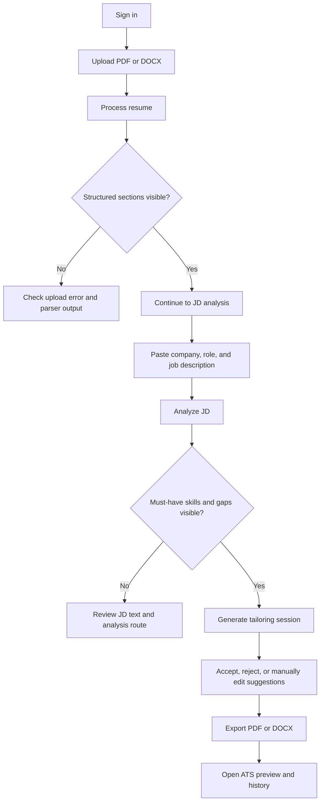

# ProofFit AI

ProofFit AI is a premium resume tailoring platform for data professionals who need truthful, ATS-safe, job-specific resumes with proof behind every important change.

It is designed to solve the biggest trust failures in resume AI products:

- generic AI output
- hallucinated experience
- keyword stuffing
- fake ATS scores
- weak parser compatibility
- privacy concerns
- hidden paywalls after upload

## Product promise

ProofFit AI is built around a simple rule: never invent what the resume does not support.

- Every important suggestion is linked to resume evidence
- Unsupported job requirements are shown as gaps
- ATS-safe output is a first-class feature
- Scoring is broken into transparent sub-scores instead of one magic number

## Tech stack

- Next.js 16 App Router
- React 19
- Tailwind CSS 4
- Supabase
- Stripe
- OpenAI API
- DOCX and PDF import/export
- Vitest for eval/unit tests
- Playwright for end-to-end workflow QA

## What is currently included

- Landing page, auth page, dashboard, workspace, ATS preview, pricing, settings, history, and admin views
- Resume upload pipeline with PDF/DOCX/text parsing
- Job description analysis route
- Tailoring engine with evidence mapping and guardrails
- PDF and DOCX export endpoints
- Privacy and deletion flows
- Supabase schema and seed files
- Prompt library, domain packs, eval plan, PRD, roadmap, and product memory files
- End-to-end QA coverage for the main local demo workflows

## Project structure

- `app/` App Router pages and API routes
- `components/` Shared UI, app layout, provider state, and workspace components
- `lib/` Prompts, services, validators, demo data, and local app state helpers
- `supabase/` SQL schema migration and seed data
- `tests/evals/` Guardrail and evaluation tests
- `tests/e2e/` Playwright workflow tests
- `context/` Durable product and technical memory
- `docs/` Supporting product copy and structure docs

## Prerequisites

- Node.js 20.9+ recommended
- npm 10+
- Windows PowerShell, Terminal, or any shell that can run Node/npm

## Quick start

1. Clone the repository:

```bash
git clone https://github.com/sarvadevishal/resume-builder-app.git
cd resume-builder-app
```

2. Install dependencies:

```bash
npm install
```

3. Create a local environment file:

Windows PowerShell:

```powershell
Copy-Item .env.example .env.local
```

macOS/Linux:

```bash
cp .env.example .env.local
```

4. Start the development server:

```bash
npm run dev
```

5. Open the app:

- `http://localhost:3000`

## Environment variables

Create `.env.local` and fill in the values you need:

```env
NEXT_PUBLIC_APP_URL=http://localhost:3000
NEXT_PUBLIC_SUPABASE_URL=
NEXT_PUBLIC_SUPABASE_ANON_KEY=
SUPABASE_SERVICE_ROLE_KEY=
OPENAI_API_KEY=
OPENAI_MODEL=gpt-5
STRIPE_SECRET_KEY=
STRIPE_WEBHOOK_SECRET=
NEXT_PUBLIC_STRIPE_PRICE_PRO=
NEXT_PUBLIC_STRIPE_PRICE_TEAM=
```

## Running in local demo mode

The app works locally without full backend credentials for the core demo workflow.

Local demo mode includes:

- local sign-in and sign-up flow
- protected routes via demo session cookie
- upload and JD analysis flow
- tailoring workspace interactions
- local PDF and DOCX export
- settings, history, and pricing interactions

You only need real external credentials when you want to connect:

- Supabase auth and persistent database state
- Google OAuth via Supabase
- OpenAI live model responses
- Stripe checkout and billing

Demo-mode behavior to know:

- local password sign-in is for testing only
- Google sign-in is intentionally disabled until Supabase is configured
- workflow progress and version history now persist per signed-in test user in the browser
- `Start new` clears the active tailoring flow but keeps saved versions
- `Clear stored resume data` removes the active resume, JD, and tailoring session
- `Clear saved versions` removes version history for the current signed-in user

## Verification commands

Run all quality checks before shipping changes:

```bash
npm run lint
npm test
npm run test:e2e
npm run build
```

## Production configuration checklist

Configure these before shipping to real testers:

1. Supabase
2. Google OAuth inside Supabase
3. OpenAI API key
4. Stripe prices and webhook
5. Deployment URL updates

### Supabase

1. Create a new Supabase project
2. Run `supabase/migrations/202604210001_prooffit_ai.sql`
3. Optionally run `supabase/seed.sql`
4. Add these values to `.env.local`:

```env
NEXT_PUBLIC_SUPABASE_URL=your-project-url
NEXT_PUBLIC_SUPABASE_ANON_KEY=your-anon-key
SUPABASE_SERVICE_ROLE_KEY=your-service-role-key
```

5. In Supabase Authentication, enable Email auth if you want password sign-in
6. Add your local and deployed callback URLs:
   - `http://localhost:3000/auth/callback`
   - `https://your-domain.com/auth/callback`

### Google sign-in

1. Create a Google OAuth client in Google Cloud
2. Add the authorized redirect URL from Supabase
3. In Supabase Authentication > Providers, enable Google
4. Paste the Google client ID and secret into Supabase
5. Restart the app after updating `.env.local`

After that, users can sign in with their own personal Gmail or Google Workspace accounts. The hardcoded demo Google user has been removed.

### OpenAI

```env
OPENAI_API_KEY=your-openai-key
OPENAI_MODEL=gpt-5
```

### Stripe

```env
STRIPE_SECRET_KEY=your-stripe-secret
STRIPE_WEBHOOK_SECRET=your-webhook-secret
NEXT_PUBLIC_STRIPE_PRICE_PRO=price_xxx
NEXT_PUBLIC_STRIPE_PRICE_TEAM=price_xxx
```

## Real workflow verification

Use this exact path when validating with a real user resume and a real JD:



Expected result:

- upload succeeds without `Resume upload failed`
- extracted sections appear on the upload page
- JD requirements and unsupported gaps appear on the analysis page
- the workspace shows proof-backed rewrites with evidence
- PDF and DOCX export complete successfully
- history retains saved versions for the signed-in user

Detailed tester checklist:

1. Sign in with email/password in demo mode, or with real Supabase auth after configuration
2. Upload one PDF resume and confirm the structured preview appears
3. Paste one job description and confirm must-have skills and gaps are shown
4. Generate a tailoring session and accept at least one change
5. Export PDF and DOCX
6. Open `ATS Preview` and confirm parser warnings render
7. Open `History` and confirm a saved version exists
8. Open `Settings` and test:
   - `Clear stored resume data`
   - `Start new`
   - `Clear saved versions`

## Main routes

- `/` Landing page
- `/auth` Sign in / sign up
- `/dashboard` Main app overview
- `/upload` Resume upload and parsing
- `/job-analysis` Job description analysis
- `/workspace` Tailoring workspace
- `/ats-preview` ATS parser preview
- `/history` Resume version history
- `/pricing` Plan selection
- `/settings` Privacy settings and audit log
- `/admin` Admin analytics overview

## Supabase setup

1. Create a Supabase project
2. Apply the SQL in `supabase/migrations/202604210001_prooffit_ai.sql`
3. Optionally seed demo records with `supabase/seed.sql`
4. Add your project keys to `.env.local`

Files:

- [schema migration](./supabase/migrations/202604210001_prooffit_ai.sql)
- [seed data](./supabase/seed.sql)

## Stripe setup

1. Create Stripe products/prices for Pro and Team
2. Add `STRIPE_SECRET_KEY`
3. Add `NEXT_PUBLIC_STRIPE_PRICE_PRO`
4. Add `NEXT_PUBLIC_STRIPE_PRICE_TEAM`
5. Add `STRIPE_WEBHOOK_SECRET`
6. Point your webhook to `/api/stripe/webhook`

## OpenAI setup

1. Add `OPENAI_API_KEY`
2. Set `OPENAI_MODEL` if you want a model different from the default
3. Replace or extend the local/demo tailoring path with live OpenAI-backed calls as needed

Prompt files:

- `lib/prompts/extract-resume.js`
- `lib/prompts/analyze-job-description.js`
- `lib/prompts/rewrite-resume.js`
- `lib/prompts/score-resume.js`

## Privacy behavior

The app is structured around privacy-first defaults:

- raw uploads should be deleted after extraction unless the user opts in
- structured resume persistence is an explicit choice
- deletion actions are exposed in settings
- audit activity is surfaced in the UI

## Known implementation note

This repository currently ships with a strong local demo workflow plus production-ready structure. Full production deployment still requires wiring real Supabase, OpenAI, and Stripe credentials and replacing local demo auth/session behavior with live backend auth.

## Documentation included in the repo

- [PRD](./PRD.md)
- [Prompt design](./PROMPT_DESIGN.md)
- [Evaluation plan](./EVALUATION_PLAN.md)
- [MVP roadmap](./MVP_ROADMAP.md)
- [Verification flow](./docs/verification-flow.md)
- [Product memory](./context/product-memory.md)
- [Technical memory](./context/technical-memory.md)
- [Future enhancements](./context/future-enhancements.md)

## Recommended next steps

1. Connect Supabase auth and row-level security to live sessions
2. Persist tailoring sessions and version history in the database
3. Wire live OpenAI generation for extraction, analysis, and rewrite steps
4. Wire live Stripe checkout and subscription sync
5. Add deployment configuration for Vercel or your preferred hosting platform
6. Add production telemetry and error monitoring before broad user rollout
