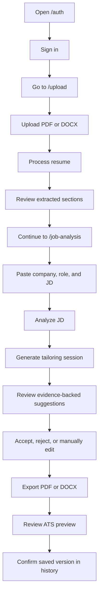

# ProofFit AI Verification Flow

## Operator goal

Verify that a real tester can sign in, upload a resume, analyze a job description, tailor the resume, and export without broken state or dead-end steps.

## Flow

## Pass criteria

- Resume upload completes without an extraction error
- The upload page shows at least one structured section
- JD analysis shows required skills, responsibilities, and gaps
- The workspace shows supported suggestions with source evidence
- PDF export downloads successfully
- DOCX export downloads successfully
- ATS Preview shows parsed sections and any warnings
- History shows at least one saved exportable version
- `Start new` clears the active workflow without deleting history
- `Clear stored resume data` clears the current resume/JD/session
- `Clear saved versions` removes user history

## Configuration needed for real-user beta

- Supabase project and migration applied
- Email auth enabled in Supabase
- Google provider enabled in Supabase if Google sign-in is desired
- OpenAI API key configured
- Stripe price IDs configured for billing tests
